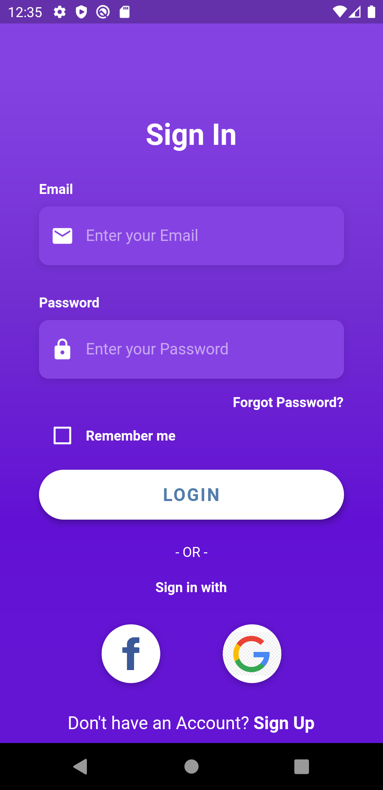
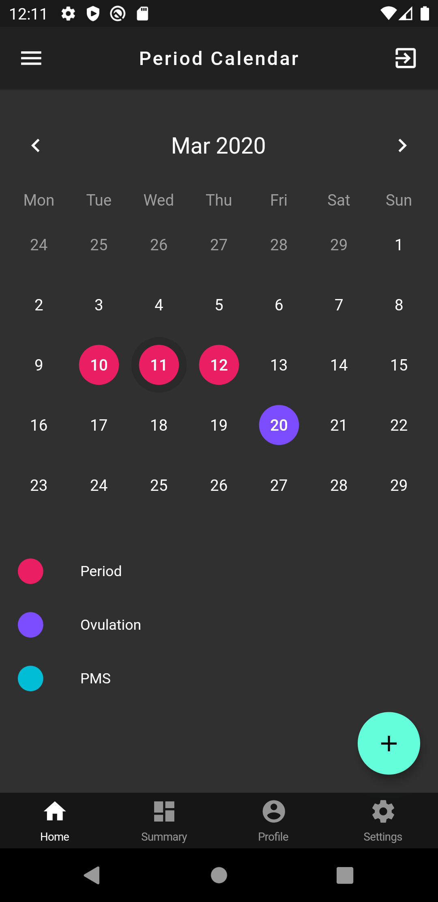
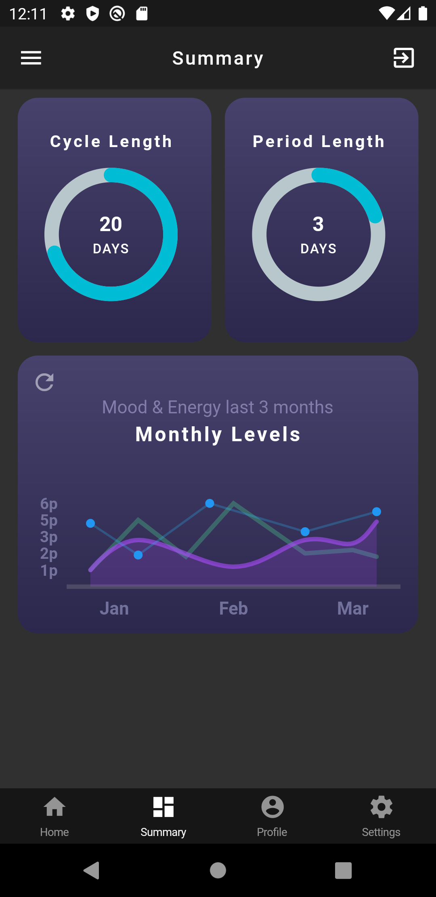
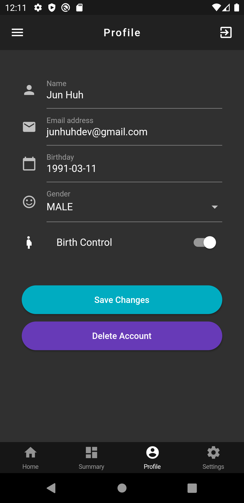
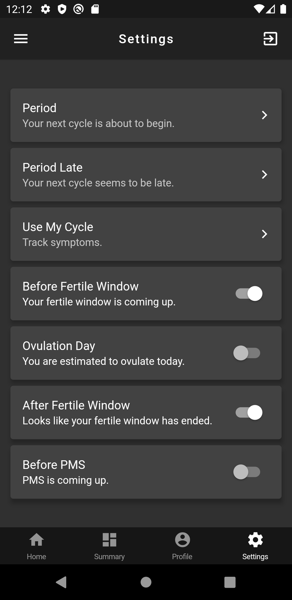

# My Cycles

  
 

## What is My Cycles?

My Cycles is a period tracker cross-platform mobile app for ios and android.

## Features available

* **summary dashboard**: provides monthly statistics for period
* **app notifications**: receive app notifications via firebase cloud functions
* **period track engine**: track your period
* **login & register**: login and register via facebook or custom account

## Folder structure

* **models**: contains the pure Dart business logic, providers, XML parsing, sanitization, i18n, models and utilities.
* **services**: contains database integrations through firebase
* **pages**: contains all the screens available
* **components**: contains all commonly shared widgets
* **functions**: contains firebase cloud functions (used for app notifications etc)

## Development environment setup

* [Install Dart for the web](https://webdev.dartlang.org/tools/sdk#install). The customized Dart version Flutter ships with is not suitable for web development.
* Install [webdev](https://webdev.dartlang.org/tools/webdev) by running `pub global activate webdev`. This requires that you ran your Dart installation properly and Dart is part of your PATH.
* Install an IDE. You can't go wrong with [WebStorm](https://webdev.dartlang.org/tools/webstorm). If that doesn't tickle your fancy, [there are other options too](https://www.dartlang.org/tools#ides).
* Install the Dart plugin for your IDE.

Finally, if you haven't already, [install Flutter](https://flutter.io/docs/get-started/install).
And the Flutter plugin for your IDE.

## Building the project

### Building from source

First, ensure that you followed the "Development environment setup" section above.

* To run the **Flutter project**, open it in your editor and click the play button, or run `flutter run` on your terminal.

## Contributing

Contributions are welcome!
However, if it's going to be a major change, please create an issue first.
Before starting to work on something, please comment on a specific issue and say you'd like to work on it.
